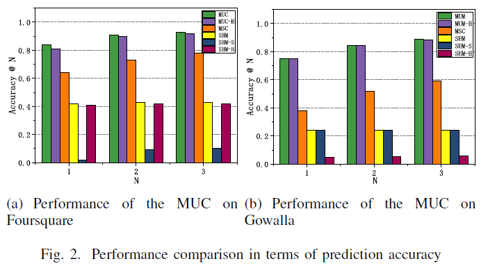

## MUC

Next Check-ins Prediction via History and Friendship on Location-Based Social Networks (MDM 2018)

## Performance

```
Details for Accuracy:

| Dataset    | Accuracy@1  | Accuracy@2   | Accuracy@3     | 
| ---------- | ------------| -------------| ---------------| 
| Foursquare | 0.8389      | 0.9105       | 0.9368         | 
| Gowalla    | 0.7522      | 0.846        | 0.8866         | 
```
- The performance of our framework on Foursquare and Gowalla.



## Requirements

- python==3.7


## Datasets

We use two real-world LBSN datasets from Foursquare and Gowalla.
```
Statistics:

| Dataset    | Number of users | Number of POIs | Number of check-ins    | Number of social links  |
| ---------- | --------------- | -------------- | ---------------------- |-------------------------|
| Foursquare | 11,326          | 182,968        | 1,385,223              | 47,164                  |
| Gowalla    | 107,092         | 1,280,969      | 6,442,890              | 950,327                 |

- Foursquare_MUC: Foursquare contains check-in data ranging from January 2011 to July 2011. 

- Gowalla_MUC: Gowalla includes check-in data between Feb. 2009 and Oct 2010.
```
## How to run MUC model

```python
1.python loc_prodict_Foursquare.py
2.python loc_prodict_Gowalla.py
```

## Citation
Please cite our paper if you use the code or datasets:
```
@inproceedings{SuLTXH18,
  title={Next Check-in Location Prediction via Footprints and Friendship on Location-Based Social Networks},
  author={Yijun Su, Xiang Li,  Wei Tang, Ji Xiang and Neng Gao},
  booktitle={IEEE International Conference on Mobile Data Management, {MDM} 2018}, 
  pages={251-256},
  doi={10.1109/MDM.2018.00044},
  year={2018}
}
```
## Contact

If you have any questions, please contact us by suyijun.ucas@gmail.com, we will be happy to assist.

Last Update Date: November 18, 2021